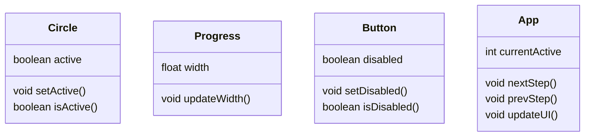
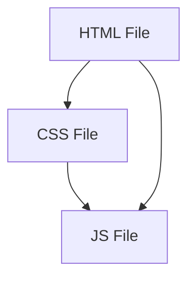
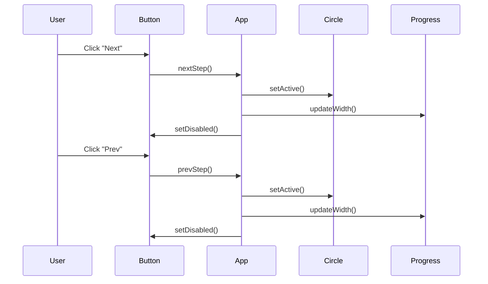

Progress Steps

1. Project Description
The "Progress Steps" is an interactive web application that displays a visual progress component, allowing the user to navigate through a series of steps represented by numbered circles. As the user moves forward or backward through the steps using "Next" and "Prev" buttons, the visual component updates to reflect the current step, with a dynamically adjusting progress bar.

2.Project Documentation

2.1. Class Diagram
The class diagram is used to show the static structure of the system, highlighting the classes, their attributes and methods, as well as the relationships between them.

  
2.2. Component Diagram
The component diagram shows the organization and dependencies of the software components in the system.

2.3. Sequence Diagram
The sequence diagram shows the interaction between different system components over time.

3. Detailed Program Description

3.1. HTML (index.html)
Defines the structure of the user interface, including the progress circles and navigation buttons.

3.2. CSS (style.css)
Applies styles to the HTML elements, defines CSS variables for colors, and manages the appearance of the progress and buttons.

3.3. JavaScript (script.js)
Contains the logic for user interaction:

Variables:

progress: Progress element.
prev: "Prev" button.
next: "Next" button.
circles: List of circle elements.
currentActive: Index of the currently active circle.
Functions:

next.addEventListener('click', ...): Increments currentActive and calls update().
prev.addEventListener('click', ...): Decrements currentActive and calls update().
update(): Updates the user interface, adjusts the progress bar width, and enables/disables buttons as needed.

4. Final Considerations
In the "Progress Steps" project, you are using the following languages, extensions, and tools:

4.1 Languages
HTML - To define the structure of the user interface.
CSS - To apply styles to the HTML elements and manage the appearance of the progress and buttons.
JavaScript - To implement the logic for user interaction and DOM manipulation.

4.2 Extensions
HTML File - Extension .html (e.g., index.html).
CSS File - Extension .css (e.g., style.css).
JavaScript File - Extension .js (e.g., script.js).

4.3 Tools
Mermaid - To create class, component, and sequence diagrams in markdown format.
These are the main languages, extensions, and tools used in the project to develop the web application and document its structure and functionality.